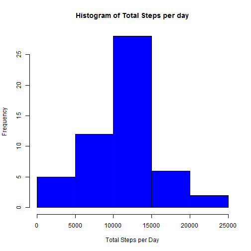
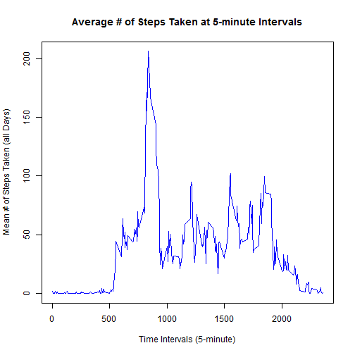

# Reproducible Research: Peer Assessment 1


## Loading and preprocessing the data

* Load **activity.csv** and convert dates.

```r
df_activity <- read.csv("activity.csv")
df_activity$date <- as.Date(df_activity$date, "%Y-%m-%d")
```


## What is mean total number of steps taken per day?

* Create vector of the total number of steps per day.

```r
v_total_steps_per_day <- tapply(df_activity$steps, df_activity$date, sum)
```


* Plot histogram of total number of steps per day.

```r
hist(v_total_steps_per_day, xlab = "Total Steps per Day", ylab = "Frequency", 
    main = "Histogram of Total Steps per day", col = "blue")
```

 


**Mean total steps taken per day:**

```r
mean(v_total_steps_per_day, na.rm = TRUE)
```

```
## [1] 10766
```


**Median total steps taken per day:**

```r
median(v_total_steps_per_day, na.rm = TRUE)
```

```
## [1] 10765
```


## What is the average daily activity pattern?

* Create a data frame with the mean of steps over all days by time interval.

```r
df_mean_steps_by_interval <- tapply(df_activity$steps, df_activity$interval, 
    mean, na.rm = TRUE)
```


* Create plot of the 5-minute interval and the average number of steps taken, averaged across all days.

```r
plot(row.names(df_mean_steps_by_interval), df_mean_steps_by_interval, type = "l", 
    ylab = "Mean # of Steps Taken (all Days)", xlab = "Time Intervals (5-minute)", 
    main = "Average # of Steps Taken at 5-minute Intervals", col = "blue")
```

 


* Determine the time interval that contains maximum average number of steps across all days.

```r
interval_num <- which.max(df_mean_steps_by_interval)
interval_max_steps <- names(interval_num)
interval_num
```

```
## 835 
## 104
```


**104th interval, which is at time value 835** 


## Imputing missing values

* Compute the number of NA values in the activity dataset.

```r
num_na_values <- sum(is.na(df_activity))
num_na_values  #Print number of NA values
```

```
## [1] 2304
```


* Fill in missing values using the average interval value across all days.

```r
v_na_indices <- which(is.na(df_activity))
v_imputed_values <- df_mean_steps_by_interval[as.character(df_activity[v_na_indices, 
    3])]
count = 0
names(v_imputed_values) <- v_na_indices
for (i in v_na_indices) {
    df_activity$steps[i] = v_imputed_values[as.character(i)]
    count = count + 1
}

cat("Total ", count, "NA values were replaced and ", sum(is.na(df_activity)), 
    " remain.\n\r")
```

```
## Total  2304 NA values were replaced and  0  remain.
## 
```


## Are there differences in activity patterns between weekdays and weekends?

* Create a new factor variable in the dataset with two levels -- "weekday" and "weekend" indicating whether a given date is a weekday or weekend day.


```r
v_days <- weekdays(df_activity$date)
df_activity$day_type <- ifelse(v_days == "Saturday" | v_days == "Sunday", "Weekend", 
    "Weekday")
df_mean_steps_by_interval <- aggregate(df_activity$steps, by = list(df_activity$interval, 
    df_activity$day_type), mean)
names(df_mean_steps_by_interval) <- c("interval", "day_type", "steps")
```


* Make a panel plot containing a time series plot (i.e. type = "l") of the 5-minute interval (x-axis) and the average number of steps taken, averaged across all weekday days or weekend days (y-axis).


```r
library(lattice)
xyplot(steps ~ interval | day_type, df_mean_steps_by_interval, type = "l", layout = c(1, 
    2), xlab = "Interval", ylab = "Number of Steps")
```

 


